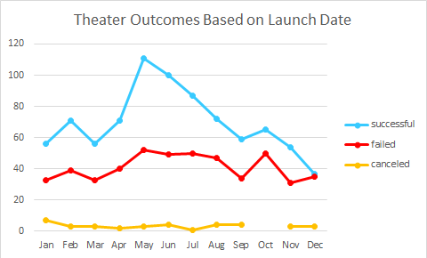
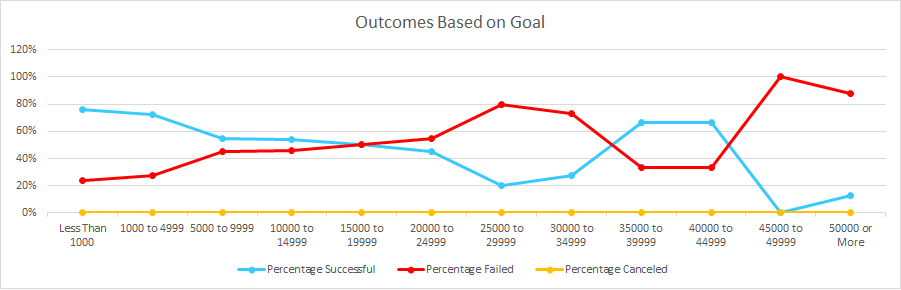

# Kickstarting with Excel

## Overview of Project 
Using data from previous Kickstarter campaigns, this project looks to uncover trends to help our client make optimal decisions to create her own successful Kickstarter. 

### Purpose
First, we use data to see if past theatrical Kickstarters were successful or not based on the month the Kickstarter launched. With this knowledge, we can see which month of the year held the best success rate for Kickstarter campaigns. Then, we will see if past play Kickstarters were successful or not based on the total amount of the goal dollar amount. We will try to find if there is a certain goal amount that proves to be the most successful, as well as see when goals start asking for to much and start failing more than succeeding. 

## Analysis and Challenges
By using Excel, we will create a graph to show the outcomes of previous Kickstarter campaigns based on both the launch date as well as the goals.

### Analysis of Outcomes Based on Launch Date
Using data from previous Kickstarter campaigns, we first need to filter the data to show only campaigns which were theater based. Then, from what we have gathered, we will then categorize it based on the month the campaigns started. We will now filter the results from each month to show whether they were successful, failed, or canceled. Using a line graph, we come up with the following: 
 

### Analysis of Outcomes Based on Goals
Using the same data from the previous Kickstarter campaigns, we will once again filter the data which were theater based, but this time go a step further to filter ones that are only related to plays. From the data gathered, we will split them up into ranges depending on how much money each goal asked for. From there, we will show in each range how many were successful, failed, or canceled. We will then determine the percentage successful, percentage failed, and percentage canceled in each range. Once again using a line graph, we come up with the following: 

### Challenges and Difficulties Encountered
For the Outcomes vs Goals graph, it was difficult how to make each range show up in the bottom vs just numerical examples, ex. 1, 2, etc. After some playing around, I noticed the Select Data option under the Chard Design Tab, and was able to include the ranges in the Horizonal Axis Labels. With that finally in place, the graph was able to be created.

## Results
*  Based on the Outcomes Based on Launch date, it seems between May through July is the most successful launch month on Kickstarter for anything theater related with May being the most successful. The least successful months is between November through January, with December having the least amount of Successful Kickstarter campaigns.
*  Based on the Outcomes Based on Goals, it seems goals that have less than 20,000 dollars have a higher chance of succeeding vs failing, as well as between 35,000 to 45,000 dollars. 
*  Possible limitations of this dataset is not knowing how long each Kickstarter lasted vs others. We can't tell how long the length of each campaign affected the success rate. Also, different countries could have different success rates vs other countries.
*  Going off the previous point, we could have included a table that showed a range of different lengths of campaigns, and turning them into a line graph that showed the success rate of each range. Another table could have been a list of countries, with categories of successful, failed, and canceled campaigns. 
